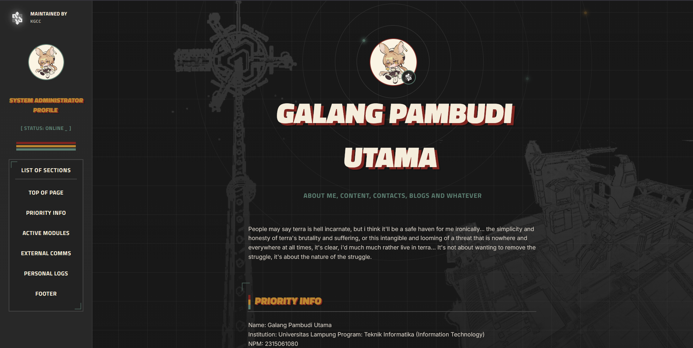
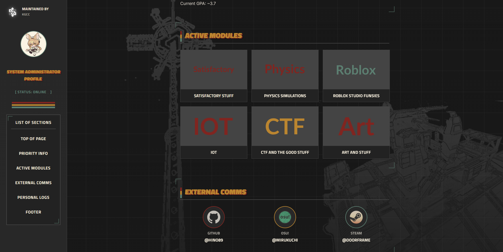
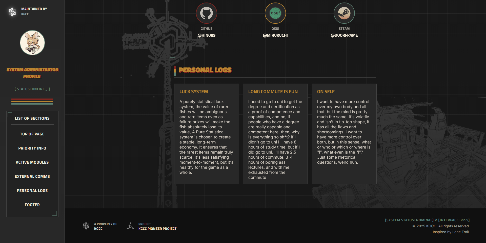
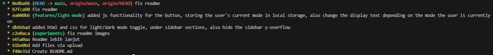
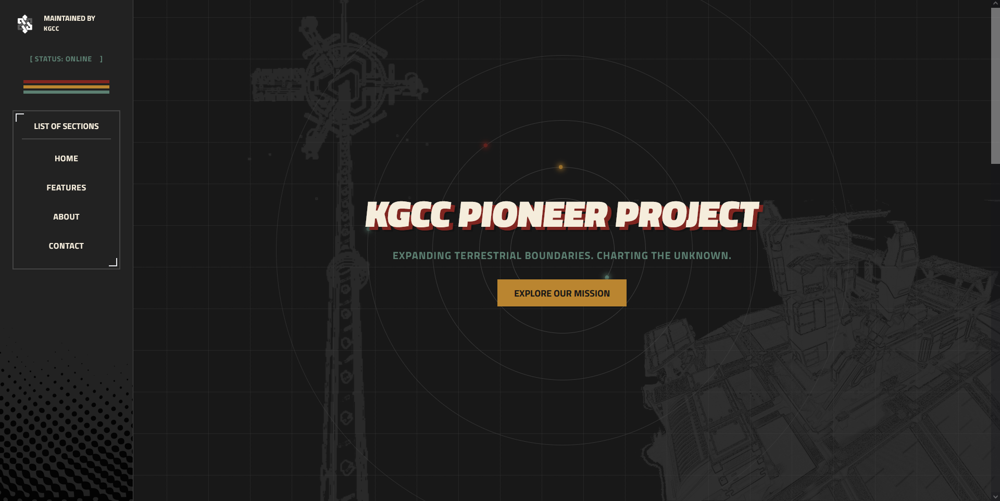

## Kumpulan Tugas Akhir dari Praktikum PW

### Project Website Portofolio menggunakan pure html, css, dan js

### Currently 4 modul
-  **Modul 1 :** inisialisasi dan pengerjaan project local dan langsung di upload ke github via website interface.
-  **Modul 2 :** eksperimen menggunakan git version control untuk manage project.
-  **Modul 3 :** eksperimen menggunakan tailwindcss framework
-  **Modul 4 :** session management, form validation, form submiting, get/post, with PHP

### Modul 1

### Modul 2

### Modul 3

### Modul 4

